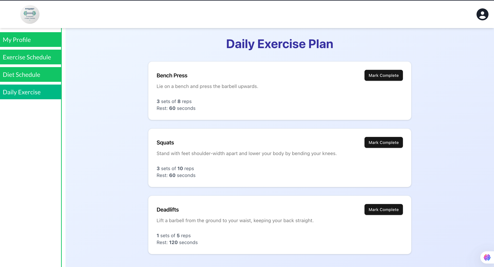
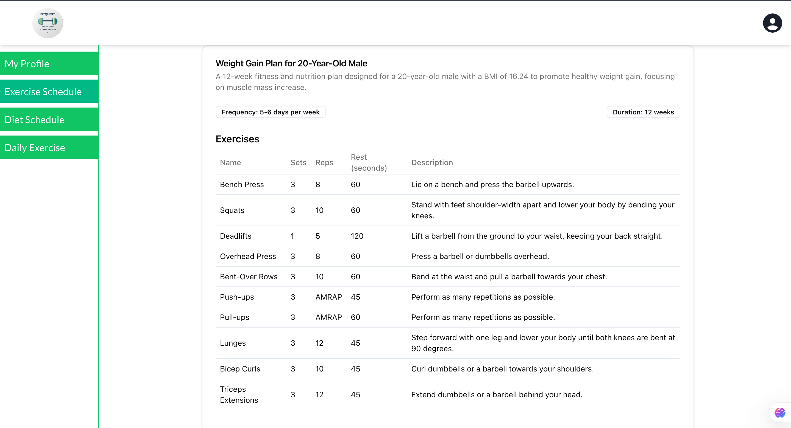

# FitQuest - Fitness Tracking App

Welcome to **FitQuest**, the ultimate fitness tracking application designed to help you achieve your health and wellness goals effectively and efficiently. This README provides an overview of the app's core functionalities and how they help users stay on track.

---

## Functionalities

### 1. Diet Plan Creation

- **Personalized Plans**: Create custom diet plans based on fitness goals (e.g., weight loss, muscle gain) and dietary preferences (e.g., vegetarian, vegan).
- **Macro and Calorie Calculations**: Automatically calculate daily calorie needs and macronutrient breakdown.
- **Editable Meal Plans**: Generate meal plans with recipes and portion sizes that users can edit.
- **Grocery List Integration**: Auto-generate grocery lists for selected meal plans.

### 2. Daily Exercise Completion with AI Guidance

- **Daily Exercise Tracking**: View assigned exercises with instructions, timers, and intensity levels.
- **Rest Day Prompts**: Receive motivational messages and suggestions for light activities on rest days.
- **AI Tips**: Get form corrections, encouragement, and tips for exercises.
- **Progress Visualization**: Track daily and weekly exercise completion through calendars or streak trackers.
  

### 3. Plan Deletion

- **Delete Exercise Plans**: Remove current exercise routines with a confirmation prompt.
- **Delete Diet Plans**: Reset diet plans with confirmation to start fresh.

### 4. Adapting to Changing Goals

- **Update Fitness Goals**: Easily switch goals like weight loss or muscle building.
- **Dynamic Plan Updates**: Automatically adjust diet and exercise plans to align with new goals.
- **AI Recommendations**: Get tailored tips and insights for success.

### 5. Progress Tracking

- **Weekly Progress Bars**: Visualize weekly progress with color-coded indicators:
  - **Green**: All exercises completed.
  - **Yellow**: Partial completion.
  - **Red**: Minimal activity.
- **Detailed Stats**: Hover over progress bars for detailed completion statistics.
- **Milestone Rewards**: Earn badges for consistency and achievements.
